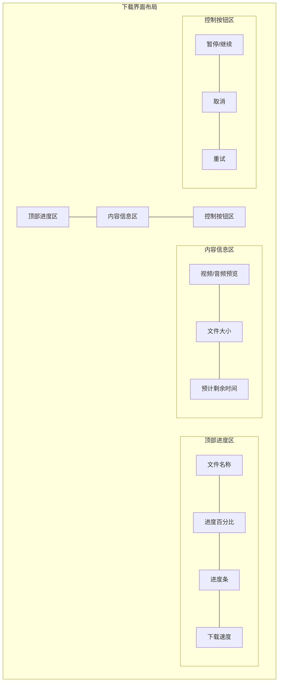

# 下载界面UI设计详细说明

## 1. 顶部进度区
- 背景色: #FFFFFF
- 阴影效果: 2dp elevation
- 内边距: 16dp
- 组件布局:
  - 文件名称:
    - 字体: Roboto Medium, 16sp
    - 颜色: #212121
    - 单行显示，超出部分省略
  - 进度百分比:
    - 字体: Roboto Regular, 14sp
    - 颜色: #2196F3
  - 进度条:
    - 高度: 4dp
    - 主色: #2196F3
    - 背景色: #E0E0E0
    - 圆角: 2dp
  - 下载速度:
    - 字体: Roboto Regular, 12sp
    - 颜色: #757575

## 2. 内容信息区
- 背景色: #F5F5F5
- 内边距: 16dp
- 组件布局:
  - 预览区域:
    - 尺寸: 160dp x 90dp
    - 背景色: #E0E0E0
    - 圆角: 8dp
    - 阴影: 1dp elevation
  - 文件信息:
    - 文件大小:
      - 字体: Roboto Regular, 14sp
      - 颜色: #757575
    - 剩余时间:
      - 字体: Roboto Regular, 14sp
      - 颜色: #757575
      - 格式: "剩余 XX:XX"

## 3. 控制按钮区
- 背景色: #FFFFFF
- 内边距: 16dp
- 按钮布局: 水平排列，等间距
- 按钮样式:
  - 暂停/继续按钮:
    - 类型: 圆形按钮
    - 尺寸: 48dp x 48dp
    - 背景色: #2196F3
    - 图标颜色: #FFFFFF
    - 阴影: 2dp elevation
  - 取消按钮:
    - 类型: 文本按钮
    - 颜色: #F44336
    - 内边距: 8dp 16dp
  - 重试按钮:
    - 类型: 文本按钮
    - 颜色: #2196F3
    - 内边距: 8dp 16dp

## 4. 动画效果
- 进度条动画: 平滑过渡
- 按钮状态切换: 淡入淡出
- 预览图加载: 淡入效果
- 进度更新: 数字滚动动画

## 5. 交互反馈
- 按钮点击: 波纹效果
- 进度变化: 实时更新
- 状态切换: 顺滑过渡
- 错误提示: 底部Snackbar

## 6. 响应式设计
- 横屏适配:
  - 预览区域靠左
  - 信息区域靠右
  - 控制按钮居中
- 不同屏幕尺寸适配:
  - 预览图大小自适应
  - 按钮间距自适应
  - 文字大小保持可读性 