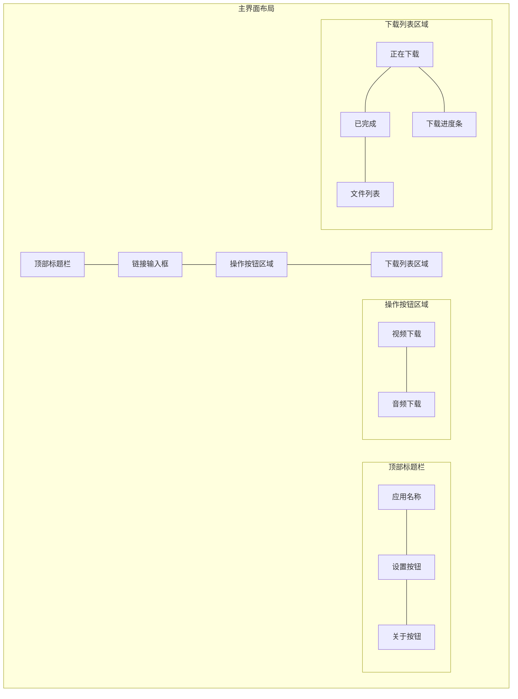

# 主界面UI设计详细说明

## 1. 顶部标题栏 (TopAppBar)
- 背景色: #2196F3 (蓝色主题)
- 高度: 56dp
- 内容:
  - 左侧: 应用图标(24x24dp) + 应用名称
  - 右侧: 设置图标和关于图标 (24x24dp)
- 字体: Roboto Medium, 20sp, 白色

## 2. 链接输入区域
- 布局: 圆角卡片式设计
- 外边距: 16dp
- 内边距: 12dp
- 组件:
  - 输入框:
    - 提示文本: "粘贴抖音分享链接"
    - 背景色: #FFFFFF
    - 圆角: 8dp
    - 边框颜色: #E0E0E0
    - 字体: Roboto Regular, 16sp
  - 粘贴按钮:
    - 图标: 剪贴板图标
    - 颜色: #2196F3
    - 大小: 24x24dp

## 3. 操作按钮区域
- 布局: 水平排列
- 外边距: 16dp
- 按钮样式:
  - 视频下载按钮:
    - 背景色: #2196F3
    - 文字颜色: 白色
    - 圆角: 24dp
    - 内边距: 12dp 24dp
    - 图标: 视频图标
    - 阴影效果: 2dp elevation
  - 音频下载按钮:
    - 背景色: #FFC107
    - 文字颜色: 黑色
    - 其他样式同视频按钮

## 4. 下载列表区域
- 背景色: #F5F5F5
- 布局: 垂直列表
- 标签栏:
  - 背景色: #FFFFFF
  - 指示器颜色: #2196F3
  - 标签文字: Roboto Medium, 14sp
- 列表项样式:
  - 卡片式设计:
    - 背景色: #FFFFFF
    - 圆角: 8dp
    - 边距: 8dp
    - 阴影: 1dp elevation
  - 内容布局:
    - 文件名: Roboto Medium, 16sp
    - 大小信息: Roboto Regular, 14sp, #757575
    - 进度条:
      - 高度: 4dp
      - 颜色: #2196F3
      - 背景色: #E0E0E0
    - 操作按钮:
      - 图标大小: 20x20dp
      - 颜色: #757575

## 5. 配色方案
- 主色调: #2196F3 (蓝色)
- 强调色: #FFC107 (琥珀色)
- 背景色: #F5F5F5 (浅灰)
- 文字颜色:
  - 主要文字: #212121
  - 次要文字: #757575
  - 提示文字: #9E9E9E

## 6. 动画效果
- 按钮点击: 波纹效果
- 列表滑动: 平滑滚动
- 进度条: 流畅过渡动画
- 卡片阴影: 点击时阴影加深

## 7. 响应式设计
- 支持横屏模式
- 列表区域自适应
- 按钮区域在横屏时水平排列
- 支持分屏模式

## 8. 交互反馈
- 输入框获得焦点时显示边框
- 按钮点击时有触觉反馈
- 操作成功/失败时显示Snackbar提示
- 下载完成时显示通知 