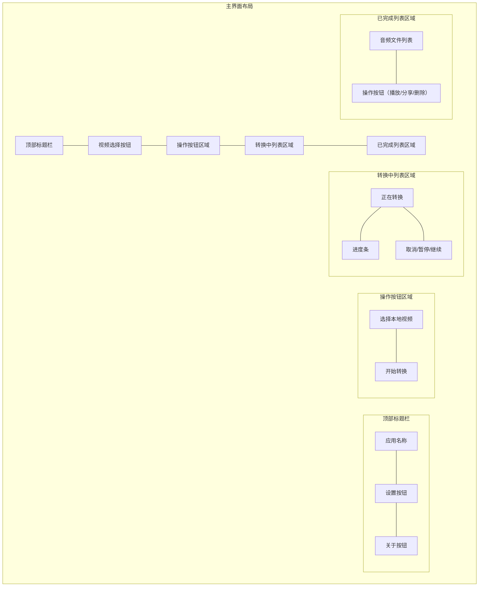

# 主界面UI设计详细说明

## 1. 顶部标题栏 (TopAppBar)
- 背景色: #2196F3 (蓝色主题)
- 高度: 56dp
- 内容:
  - 左侧: 应用图标(24x24dp) + 应用名称
  - 右侧: 设置图标和关于图标 (24x24dp)
- 字体: Roboto Medium, 20sp, 白色

## 2. 视频选择与操作区域
- 布局: 水平排列
- 外边距: 16dp
- 组件:
  - 选择本地视频按钮:
    - 背景色: #2196F3
    - 文字颜色: 白色
    - 圆角: 24dp
    - 内边距: 12dp 24dp
    - 图标: 文件选择图标
    - 阴影效果: 2dp elevation
  - 开始转换按钮:
    - 背景色: #FFC107
    - 文字颜色: 黑色
    - 其他样式同上

## 3. 转换中列表区域
- 背景色: #F5F5F5
- 布局: 垂直列表
- 列表项样式:
  - 卡片式设计:
    - 背景色: #FFFFFF
    - 圆角: 8dp
    - 边距: 8dp
    - 阴影: 1dp elevation
  - 内容布局:
    - 文件名: Roboto Medium, 16sp
    - 进度条: 高度4dp，主色#2196F3，背景#E0E0E0
    - 操作按钮: 暂停/继续/取消

## 4. 已完成列表区域
- 背景色: #F5F5F5
- 布局: 垂直列表
- 列表项样式:
  - 卡片式设计:
    - 背景色: #FFFFFF
    - 圆角: 8dp
    - 边距: 8dp
    - 阴影: 1dp elevation
  - 内容布局:
    - 文件名: Roboto Medium, 16sp
    - 操作按钮: 播放/分享/删除

## 5. 配色方案
- 主色调: #2196F3 (蓝色)
- 强调色: #FFC107 (琥珀色)
- 背景色: #F5F5F5 (浅灰)
- 文字颜色:
  - 主要文字: #212121
  - 次要文字: #757575
  - 提示文字: #9E9E9E

## 6. 动画与交互反馈
- 按钮点击: 波纹效果
- 进度条: 流畅过渡动画
- 操作成功/失败时显示Snackbar提示
- 转换完成时显示通知

## 7. 响应式设计
- 支持横屏模式
- 列表区域自适应
- 按钮区域在横屏时水平排列
- 支持分屏模式 