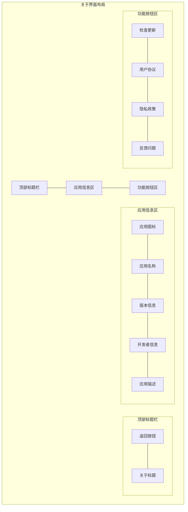

# 关于界面UI设计详细说明

## 1. 顶部标题栏
- 背景色: #2196F3
- 高度: 56dp
- 阴影效果: 4dp elevation
- 组件布局:
  - 返回按钮:
    - 位置: 左侧
    - 图标: 白色箭头图标
    - 内边距: 16dp
    - 点击效果: 波纹
  - 标题文本:
    - 文本: "关于"
    - 字体: Roboto Medium, 20sp
    - 颜色: #FFFFFF
    - 位置: 居中

## 2. 应用信息区
- 背景色: #FFFFFF
- 内边距: 24dp
- 组件布局:
  - 应用图标:
    - 尺寸: 96dp x 96dp
    - 位置: 顶部居中
    - 阴影: 2dp elevation
    - 边距: 底部24dp
    
  - 应用名称:
    - 字体: Roboto Medium, 24sp
    - 颜色: #212121
    - 位置: 居中
    - 边距: 底部8dp
    
  - 版本信息:
    - 字体: Roboto Regular, 14sp
    - 颜色: #757575
    - 位置: 居中
    - 格式: "版本 X.X.X"
    - 边距: 底部24dp
    
  - 开发者信息:
    - 字体: Roboto Regular, 14sp
    - 颜色: #757575
    - 位置: 居中
    - 边距: 底部16dp
    
  - 应用描述:
    - 字体: Roboto Regular, 14sp
    - 颜色: #757575
    - 位置: 居中
    - 行间距: 1.5
    - 对齐: 居中
    - 边距: 左右24dp

## 3. 功能按钮区
- 背景色: #FFFFFF
- 内边距: 16dp
- 分割线:
  - 颜色: #EEEEEE
  - 高度: 1dp
- 按钮样式:
  - 通用属性:
    - 高度: 48dp
    - 内边距: 左右16dp
    - 字体: Roboto Regular, 16sp
    - 图标: 左侧24dp
    - 点击效果: 波纹
    
  - 检查更新按钮:
    - 图标: 更新图标
    - 文本颜色: #2196F3
    - 右侧显示版本号
    
  - 用户协议按钮:
    - 图标: 文档图标
    - 文本颜色: #212121
    - 右侧箭头图标
    
  - 隐私政策按钮:
    - 图标: 隐私图标
    - 文本颜色: #212121
    - 右侧箭头图标
    
  - 反馈问题按钮:
    - 图标: 反馈图标
    - 文本颜色: #212121
    - 右侧箭头图标

## 4. 动画效果
- 页面切换: 滑动过渡
- 按钮点击: Material波纹效果
- 更新检查: 加载动画

## 5. 交互反馈
- 更新检查:
  - 检查中loading动画
  - 最新版本提示
  - 发现新版本提示
  - 网络错误提示
- 按钮点击:
  - 波纹反馈
  - 跳转过渡动画

## 6. 响应式设计
- 横屏适配:
  - 信息区和按钮区并排显示
  - 内容居中对齐
- 不同屏幕尺寸:
  - 图标大小自适应
  - 文字大小保持可读性
  - 边距自适应调整 