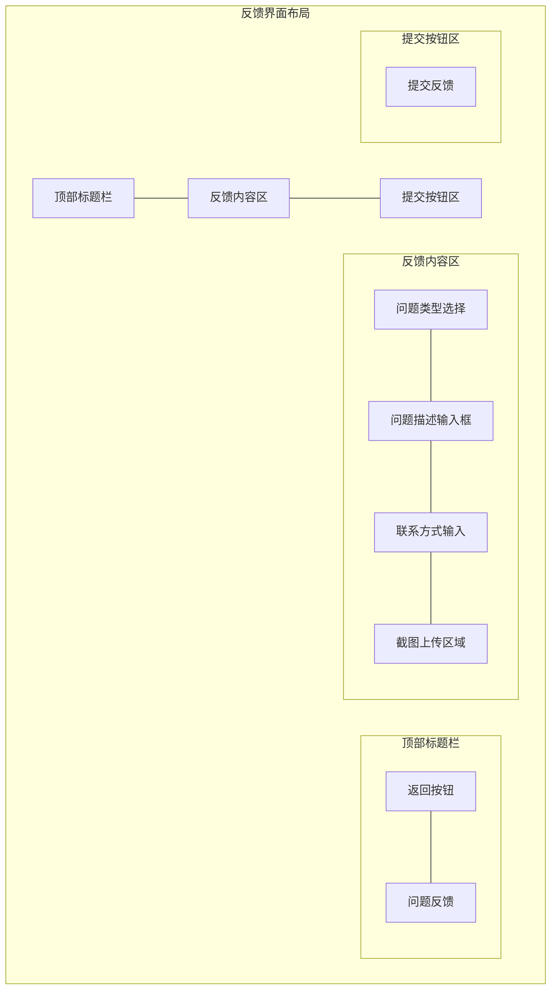

# 反馈界面UI设计详细说明

## 1. 顶部标题栏
- 背景色: #2196F3
- 高度: 56dp
- 阴影效果: 4dp elevation
- 组件布局:
  - 返回按钮:
    - 位置: 左侧
    - 图标: 白色箭头图标
    - 内边距: 16dp
    - 点击效果: 波纹
  - 标题文本:
    - 文本: "问题反馈"
    - 字体: Roboto Medium, 20sp
    - 颜色: #FFFFFF
    - 位置: 居中

## 2. 反馈内容区
- 背景色: #FFFFFF
- 内边距: 16dp
- 组件布局:
  - 问题类型选择:
    - 类型: Material Dropdown
    - 标签: "问题类型"
    - 字体: Roboto Regular, 16sp
    - 选项列表:
      - 功能异常
      - 界面问题
      - 性能问题
      - 建议优化
      - 其他问题
    - 边框颜色: #BDBDBD
    - 激活颜色: #2196F3
    - 圆角: 4dp
    - 上下边距: 16dp
    
  - 问题描述输入框:
    - 类型: Material TextArea
    - 标签: "问题描述"
    - 提示文本: "请详细描述您遇到的问题..."
    - 最小高度: 120dp
    - 最大字数: 500
    - 字体: Roboto Regular, 14sp
    - 边框颜色: #BDBDBD
    - 激活颜色: #2196F3
    - 圆角: 4dp
    - 上下边距: 16dp
    
  - 联系方式输入:
    - 类型: Material TextField
    - 标签: "联系方式（选填）"
    - 提示文本: "请留下您的邮箱或手机号..."
    - 字体: Roboto Regular, 14sp
    - 边框颜色: #BDBDBD
    - 激活颜色: #2196F3
    - 圆角: 4dp
    - 上下边距: 16dp
    
  - 截图上传区域:
    - 背景色: #F5F5F5
    - 边框: 虚线，颜色 #BDBDBD
    - 圆角: 8dp
    - 内边距: 16dp
    - 高度: 120dp
    - 上传按钮:
      - 图标: 相机图标
      - 颜色: #757575
      - 文本: "点击上传截图（可选）"
      - 字体: Roboto Regular, 14sp
    - 图片预览:
      - 尺寸: 80dp x 80dp
      - 圆角: 4dp
      - 删除按钮: 右上角红色图标

## 3. 提交按钮区
- 背景色: #FFFFFF
- 内边距: 16dp
- 按钮样式:
  - 类型: Material Button (filled)
  - 文本: "提交反馈"
  - 字体: Roboto Medium, 16sp
  - 颜色: #FFFFFF
  - 背景色: #2196F3
  - 宽度: match_parent
  - 高度: 48dp
  - 圆角: 24dp
  - 阴影: 2dp elevation
  - 点击效果: 波纹

## 4. 交互反馈
- 输入验证:
  - 必填项未填提示
  - 格式错误提示
  - 字数超限提示
- 提交状态:
  - 加载动画
  - 成功提示
  - 失败提示
- 按钮状态:
  - 禁用状态（必填项未填）
  - 加载状态
  - 正常状态

## 5. 响应式设计
- 键盘弹出时布局自适应
- 横屏模式优化:
  - 内容区双列布局
  - 按钮固定在底部
- 不同屏幕尺寸适配:
  - 边距自适应
  - 输入框高度自适应
  - 文字大小保持可读性 