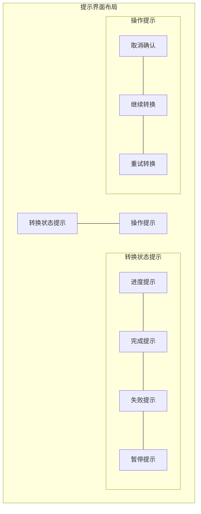

# 提示界面UI设计详细说明

## 1. 通知栏提示样式
- 背景色: #FFFFFF
- 阴影效果: 2dp elevation
- 通用样式:
  - 图标尺寸: 24dp
  - 文本字体: Roboto Regular
  - 内边距: 16dp

### 1.1 转换进度提示
- 布局:
  - 图标: 转换图标 (#2196F3)
  - 标题:
    - 字体: Roboto Medium, 14sp
    - 颜色: #212121
  - 进度条:
    - 高度: 2dp
    - 主色: #2196F3
    - 背景色: #E0E0E0
  - 进度文本:
    - 字体: Roboto Regular, 12sp
    - 颜色: #757575
    - 格式: "XX%"
  - 操作按钮:
    - 暂停/继续: 图标按钮
    - 取消: 图标按钮

### 1.2 转换完成提示
- 布局:
  - 图标: 完成图标 (#4CAF50)
  - 标题:
    - 文本: "转换完成"
    - 字体: Roboto Medium, 14sp
    - 颜色: #212121
  - 文件名:
    - 字体: Roboto Regular, 12sp
    - 颜色: #757575
  - 操作按钮:
    - "打开文件": 文本按钮
    - "查看位置": 文本按钮

### 1.3 转换失败提示
- 布局:
  - 图标: 错误图标 (#F44336)
  - 标题:
    - 文本: "转换失败"
    - 字体: Roboto Medium, 14sp
    - 颜色: #212121
  - 错误信息:
    - 字体: Roboto Regular, 12sp
    - 颜色: #757575
  - 操作按钮:
    - "重试": 文本按钮
    - "取消": 文本按钮

### 1.4 转换暂停提示
- 布局:
  - 图标: 暂停图标 (#FFC107)
  - 标题:
    - 文本: "转换已暂停"
    - 字体: Roboto Medium, 14sp
    - 颜色: #212121
  - 进度信息:
    - 字体: Roboto Regular, 12sp
    - 颜色: #757575
  - 操作按钮:
    - "继续": 文本按钮
    - "取消": 文本按钮

## 2. 应用内提示对话框

### 2.1 确认对话框
- 背景色: #FFFFFF
- 圆角: 8dp
- 阴影: 8dp elevation
- 内边距: 24dp
- 组件布局:
  - 标题:
    - 字体: Roboto Medium, 20sp
    - 颜色: #212121
    - 边距: 底部16dp
  - 内容文本:
    - 字体: Roboto Regular, 16sp
    - 颜色: #757575
    - 边距: 底部24dp
  - 按钮区:
    - 布局: 右对齐
    - "取消" 按钮:
      - 类型: 文本按钮
      - 颜色: #757575
    - "确认" 按钮:
      - 类型: 文本按钮
      - 颜色: #2196F3

### 2.2 进度对话框
- 背景色: #FFFFFF
- 圆角: 8dp
- 阴影: 8dp elevation
- 内边距: 24dp
- 组件布局:
  - 进度指示器:
    - 类型: 圆形进度条
    - 颜色: #2196F3
    - 尺寸: 48dp
  - 提示文本:
    - 字体: Roboto Regular, 16sp
    - 颜色: #212121
    - 边距: 顶部16dp

### 2.3 Toast提示
- 背景色: #323232
- 圆角: 4dp
- 内边距: 16dp
- 文本:
  - 字体: Roboto Regular, 14sp
  - 颜色: #FFFFFF
- 显示时长: 2000ms
- 位置: 底部居中

## 3. 动画效果
- 通知展开/收起:
  - 动画时长: 200ms
  - 过渡效果: 渐变+展开
- 对话框显示/隐藏:
  - 动画时长: 250ms
  - 过渡效果: 缩放+渐变
- 进度条更新:
  - 动画时长: 300ms
  - 过渡效果: 平滑过渡
- Toast显示/隐藏:
  - 动画时长: 200ms
  - 过渡效果: 渐变+上移

## 4. 交互反馈
- 按钮点击:
  - 波纹效果
  - 触觉反馈
- 通知滑动:
  - 左右滑动关闭
  - 展开/收起手势
- 对话框:
  - 点击外部关闭
  - 返回键响应

## 5. 响应式设计
- 通知栏:
  - 宽度自适应
  - 内容自动换行
- 对话框:
  - 居中显示
  - 宽度自适应
  - 最大宽度限制
- Toast:
  - 文本自动换行
  - 宽度自适应 