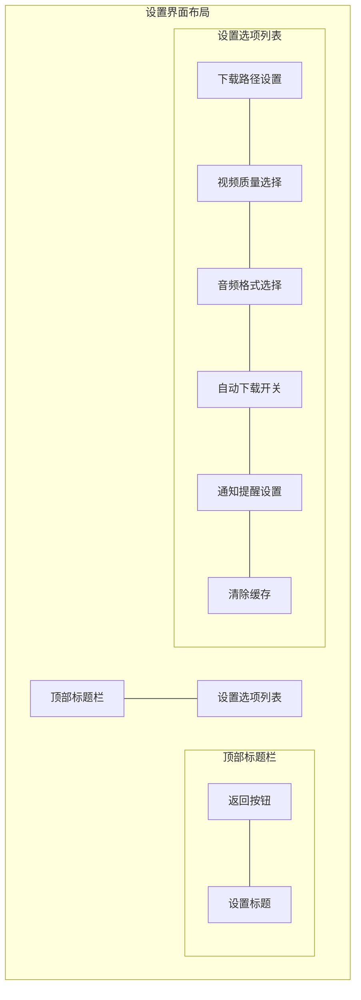

# 设置界面UI设计详细说明

## 1. 顶部标题栏
- 背景色: #2196F3
- 高度: 56dp
- 阴影效果: 4dp elevation
- 组件布局:
  - 返回按钮:
    - 位置: 左侧
    - 图标: 白色箭头图标
    - 内边距: 16dp
    - 点击效果: 波纹
  - 标题文本:
    - 文本: "设置"
    - 字体: Roboto Medium, 20sp
    - 颜色: #FFFFFF
    - 位置: 居中

## 2. 设置选项列表
- 背景色: #FFFFFF
- 分组样式:
  - 组标题:
    - 字体: Roboto Medium, 14sp
    - 颜色: #757575
    - 内边距: 16dp
  - 分割线:
    - 颜色: #EEEEEE
    - 高度: 1dp

### 2.1 下载路径设置
- 类型: 列表项
- 高度: 72dp
- 内边距: 16dp
- 组件布局:
  - 图标:
    - 类型: 文件夹图标
    - 颜色: #757575
    - 尺寸: 24dp
  - 文本区:
    - 主标题:
      - 文本: "下载路径"
      - 字体: Roboto Regular, 16sp
      - 颜色: #212121
    - 副标题:
      - 文本: 当前选择的路径
      - 字体: Roboto Regular, 14sp
      - 颜色: #757575
  - 右侧箭头图标

### 2.2 视频质量选择
- 类型: 列表项
- 高度: 72dp
- 内边距: 16dp
- 组件布局:
  - 图标:
    - 类型: 视频质量图标
    - 颜色: #757575
    - 尺寸: 24dp
  - 文本区:
    - 主标题:
      - 文本: "视频质量"
      - 字体: Roboto Regular, 16sp
      - 颜色: #212121
    - 副标题:
      - 文本: 当前选择的质量
      - 字体: Roboto Regular, 14sp
      - 颜色: #757575
  - 下拉选择器:
    - 选项:
      - 超清 (1080P)
      - 高清 (720P)
      - 标清 (480P)
      - 流畅 (360P)

### 2.3 音频格式选择
- 类型: 列表项
- 高度: 72dp
- 内边距: 16dp
- 组件布局:
  - 图标:
    - 类型: 音频图标
    - 颜色: #757575
    - 尺寸: 24dp
  - 文本区:
    - 主标题:
      - 文本: "音频格式"
      - 字体: Roboto Regular, 16sp
      - 颜色: #212121
    - 副标题:
      - 文本: 当前选择的格式
      - 字体: Roboto Regular, 14sp
      - 颜色: #757575
  - 下拉选择器:
    - 选项:
      - MP3
      - AAC
      - WAV

### 2.4 自动下载开关
- 类型: 列表项
- 高度: 56dp
- 内边距: 16dp
- 组件布局:
  - 图标:
    - 类型: 自动下载图标
    - 颜色: #757575
    - 尺寸: 24dp
  - 文本:
    - 文本: "自动下载"
    - 字体: Roboto Regular, 16sp
    - 颜色: #212121
  - Switch开关:
    - 颜色: #2196F3
    - 尺寸: 标准Material Switch

### 2.5 通知提醒设置
- 类型: 列表项
- 高度: 56dp
- 内边距: 16dp
- 组件布局:
  - 图标:
    - 类型: 通知图标
    - 颜色: #757575
    - 尺寸: 24dp
  - 文本:
    - 文本: "通知提醒"
    - 字体: Roboto Regular, 16sp
    - 颜色: #212121
  - Switch开关:
    - 颜色: #2196F3
    - 尺寸: 标准Material Switch

### 2.6 清除缓存
- 类型: 列表项
- 高度: 72dp
- 内边距: 16dp
- 组件布局:
  - 图标:
    - 类型: 清除图标
    - 颜色: #757575
    - 尺寸: 24dp
  - 文本区:
    - 主标题:
      - 文本: "清除缓存"
      - 字体: Roboto Regular, 16sp
      - 颜色: #212121
    - 副标题:
      - 文本: 当前缓存大小
      - 字体: Roboto Regular, 14sp
      - 颜色: #757575
  - 右侧箭头图标

## 3. 交互反馈
- 列表项点击:
  - 波纹效果
  - 颜色: #E0E0E0
- 开关切换:
  - 动画过渡
  - 状态颜色变化
- 选项更改:
  - 实时保存
  - 成功提示
- 清除缓存:
  - 确认对话框
  - 进度指示器
  - 完成提示

## 4. 响应式设计
- 横屏适配:
  - 列表项保持宽度
  - 内容居中对齐
- 不同屏幕尺寸:
  - 边距自适应
  - 文字大小保持可读性
  - 图标大小保持比例 